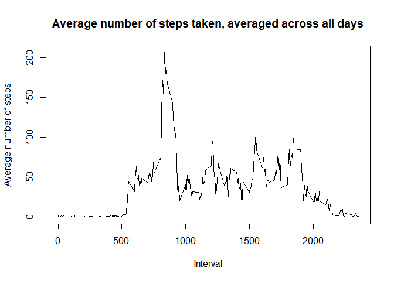
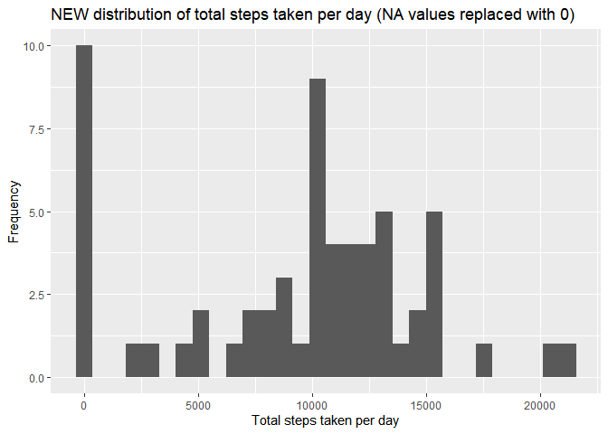

## Loading and preprocessing the data
1. Loading and first investigation of the dataset:  

```r
dataset <- "activity.csv"

dataset_folder <- if (!file.exists("activity.csv")){
        unzip("activity.zip")
}

dataset <- read.csv("activity.csv")
dim(dataset)
```

```
## [1] 17568     3
```

```r
head(dataset)
```

```
##   steps       date interval
## 1    NA 2012-10-01        0
## 2    NA 2012-10-01        5
## 3    NA 2012-10-01       10
## 4    NA 2012-10-01       15
## 5    NA 2012-10-01       20
## 6    NA 2012-10-01       25
```

```r
mean(is.na(dataset))
```

```
## [1] 0.04371585
```
Our dataset has 17568 rows and 3 columns. It also contains 4.37% NA (missing) values.  

2. Removal of the NA values from the dataset:  

```r
library(dplyr)
```

```
## 
## Attaching package: 'dplyr'
```

```
## The following objects are masked from 'package:stats':
## 
##     filter, lag
```

```
## The following objects are masked from 'package:base':
## 
##     intersect, setdiff, setequal, union
```

```r
filtered_dataset <- dataset %>% filter(!is.na(steps))
str(filtered_dataset)
```

```
## 'data.frame':	15264 obs. of  3 variables:
##  $ steps   : int  0 0 0 0 0 0 0 0 0 0 ...
##  $ date    : chr  "2012-10-02" "2012-10-02" "2012-10-02" "2012-10-02" ...
##  $ interval: int  0 5 10 15 20 25 30 35 40 45 ...
```


## What is mean total number of steps taken per day?
1. Calculation of total number of steps taken per day:    

```r
filtered_dataset$date <- as.Date(filtered_dataset$date)
str(filtered_dataset)
```

```
## 'data.frame':	15264 obs. of  3 variables:
##  $ steps   : int  0 0 0 0 0 0 0 0 0 0 ...
##  $ date    : Date, format: "2012-10-02" "2012-10-02" ...
##  $ interval: int  0 5 10 15 20 25 30 35 40 45 ...
```

```r
steps_per_day <- filtered_dataset %>% group_by(date) %>% summarise(sum(steps)) %>% rename(total_steps='sum(steps)')
head(steps_per_day)
```

```
## # A tibble: 6 x 2
##   date       total_steps
##   <date>           <int>
## 1 2012-10-02         126
## 2 2012-10-03       11352
## 3 2012-10-04       12116
## 4 2012-10-05       13294
## 5 2012-10-06       15420
## 6 2012-10-07       11015
```

2. Histogram of total number of steps taken per day:   

```r
library(ggplot2)

g <- ggplot(steps_per_day, aes(total_steps))
g+geom_histogram()+ggtitle("Distribution of total steps taken per day (NA values removed)")+xlab("Total steps taken per day")+ylab("Frequency")
```

```
## `stat_bin()` using `bins = 30`. Pick better value with `binwidth`.
```

<!-- -->

3. Mean and Median of total number of steps taken per day:   

```r
mean(steps_per_day$total_steps)
```

```
## [1] 10766.19
```

```r
median(steps_per_day$total_steps)
```

```
## [1] 10765
```
We have a mean of 10766 steps and a median of 10765 steps.


## What is the average daily activity pattern?
1. Time series plot of the 5-minute interval (x-axis) and the average number of steps taken, averaged across all days (y-axis):  

```r
average <- tapply(dataset$steps, dataset$interval, mean, na.rm=TRUE)
summary(is.na(average))
```

```
##    Mode   FALSE 
## logical     288
```

```r
df_iavg <- data.frame(interval=as.integer(names(average)), avg=average)
summary(df_iavg)
```

```
##     interval           avg         
##  Min.   :   0.0   Min.   :  0.000  
##  1st Qu.: 588.8   1st Qu.:  2.486  
##  Median :1177.5   Median : 34.113  
##  Mean   :1177.5   Mean   : 37.383  
##  3rd Qu.:1766.2   3rd Qu.: 52.835  
##  Max.   :2355.0   Max.   :206.170
```

```r
with(df_iavg, plot(interval, avg, type = "l", xlab = "5-minute interval", ylab = "Average number of steps"))
```

<!-- -->

2. Calculation of the 5-minute interval containing the maximum number of steps, on average across all the days in the dataset:  

```r
max_steps <- max(df_iavg$avg)
df_iavg[df_iavg$avg == max_steps, ]
```

```
##     interval      avg
## 835      835 206.1698
```
The interval at 835 contains the maximum number of 206 steps.


## Imputing missing values
1. The total number of missing values in the dataset (TRUE = missing values):  

```r
summary(is.na(dataset))
```

```
##    steps            date          interval      
##  Mode :logical   Mode :logical   Mode :logical  
##  FALSE:15264     FALSE:17568     FALSE:17568    
##  TRUE :2304
```
Our dataset contains 2304 total missing values (NA's).

2. Filling in all of the missing values in the dataset,   
3. and creating a new dataset:   

```r
library(tidyr)

new_dataset <- dataset %>% replace_na(list(steps=0))
str(new_dataset)
```

```
## 'data.frame':	17568 obs. of  3 variables:
##  $ steps   : num  0 0 0 0 0 0 0 0 0 0 ...
##  $ date    : chr  "2012-10-01" "2012-10-01" "2012-10-01" "2012-10-01" ...
##  $ interval: int  0 5 10 15 20 25 30 35 40 45 ...
```

```r
summary(is.na(new_dataset))
```

```
##    steps            date          interval      
##  Mode :logical   Mode :logical   Mode :logical  
##  FALSE:17568     FALSE:17568     FALSE:17568
```
Replaced all NA values in columns "steps" with 0. Compared with the previous summary, we don't have any is.na = TRUE anymore. That means, because our NA values are now 0, they have been added to steps = FALSE.  

4. Histogram of total number of steps taken per day based on the new_dataset:

```r
new_dataset$date <- as.Date(new_dataset$date)
new_dataset$steps <- as.integer(new_dataset$steps)
str(new_dataset)
```

```
## 'data.frame':	17568 obs. of  3 variables:
##  $ steps   : int  0 0 0 0 0 0 0 0 0 0 ...
##  $ date    : Date, format: "2012-10-01" "2012-10-01" ...
##  $ interval: int  0 5 10 15 20 25 30 35 40 45 ...
```

```r
steps_per_day_new <- new_dataset %>% group_by(date) %>% summarise(sum(steps)) %>% rename(total_steps_new ='sum(steps)')
head(steps_per_day_new)
```

```
## # A tibble: 6 x 2
##   date       total_steps_new
##   <date>               <int>
## 1 2012-10-01               0
## 2 2012-10-02             126
## 3 2012-10-03           11352
## 4 2012-10-04           12116
## 5 2012-10-05           13294
## 6 2012-10-06           15420
```

```r
a <- ggplot(steps_per_day_new, aes(total_steps_new))
a+geom_histogram()+ggtitle("NEW distribution of total steps taken per day (NA values replaced with 0)")+xlab("Total steps taken per day")+ylab("Frequency")
```

```
## `stat_bin()` using `bins = 30`. Pick better value with `binwidth`.
```

<!-- -->

```r
mean(steps_per_day_new$total_steps_new)
```

```
## [1] 9354.23
```

```r
median(steps_per_day_new$total_steps_new)
```

```
## [1] 10395
```
Due to the number of new values (NA's have been replaced with 0, not removed), our new mean dropped to 9354 steps as well as our median shifted to 10395 steps.


## Are there differences in activity patterns between weekdays and weekends?
