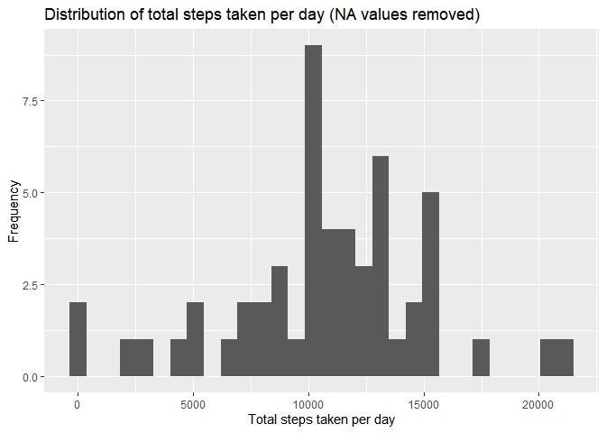

## Loading and preprocessing the data

```r
dataset <- "activity.csv"

dataset_folder <- if (!file.exists("activity.csv")){
        unzip("activity.zip")
}

dataset <- read.csv("activity.csv")
dim(dataset)
```

```
## [1] 17568     3
```

```r
head(dataset)
```

```
##   steps       date interval
## 1    NA 2012-10-01        0
## 2    NA 2012-10-01        5
## 3    NA 2012-10-01       10
## 4    NA 2012-10-01       15
## 5    NA 2012-10-01       20
## 6    NA 2012-10-01       25
```

```r
mean(is.na(dataset))
```

```
## [1] 0.04371585
```

### remove NA values from dataset

```r
library(dplyr)
```

```
## 
## Attaching package: 'dplyr'
```

```
## The following objects are masked from 'package:stats':
## 
##     filter, lag
```

```
## The following objects are masked from 'package:base':
## 
##     intersect, setdiff, setequal, union
```

```r
filtered_dataset <- dataset %>% filter(!is.na(steps))
str(filtered_dataset)
```

```
## 'data.frame':	15264 obs. of  3 variables:
##  $ steps   : int  0 0 0 0 0 0 0 0 0 0 ...
##  $ date    : chr  "2012-10-02" "2012-10-02" "2012-10-02" "2012-10-02" ...
##  $ interval: int  0 5 10 15 20 25 30 35 40 45 ...
```

## What is mean total number of steps taken per day?
### Total number of steps taken per day

```r
filtered_dataset$date <- as.Date(filtered_dataset$date)
str(filtered_dataset)
```

```
## 'data.frame':	15264 obs. of  3 variables:
##  $ steps   : int  0 0 0 0 0 0 0 0 0 0 ...
##  $ date    : Date, format: "2012-10-02" "2012-10-02" ...
##  $ interval: int  0 5 10 15 20 25 30 35 40 45 ...
```

```r
steps_per_day <- filtered_dataset %>% group_by(date) %>% summarise(sum(steps)) %>% rename(total_steps='sum(steps)')
head(steps_per_day)
```

```
## # A tibble: 6 x 2
##   date       total_steps
##   <date>           <int>
## 1 2012-10-02         126
## 2 2012-10-03       11352
## 3 2012-10-04       12116
## 4 2012-10-05       13294
## 5 2012-10-06       15420
## 6 2012-10-07       11015
```

### Histogram steps_per_day (total)

```r
library(ggplot2)

g <- ggplot(steps_per_day, aes(date))
g+geom_histogram()
```

```
## `stat_bin()` using `bins = 30`. Pick better value with `binwidth`.
```

<!-- -->

## What is the average daily activity pattern?


## Imputing missing values


## Are there differences in activity patterns between weekdays and weekends?
